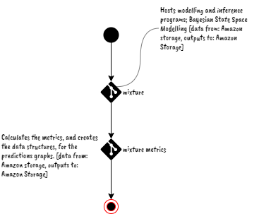

# Warning Period

This page outlines the orchestrations of the automatic updates that occur during a weather warning period.

## Metrics

<!--suppress HtmlUnknownAttribute -->
<figure markdown="span">
  {align=left}
  <figcaption>At present, every 2 hours.</figcaption>
</figure>

 
 

## Predictions

<figure markdown="span">
{align=left}
  <figcaption>At present, every 12 hours.</figcaption>
</figure>

 
 

 
 

 
 

 
 
